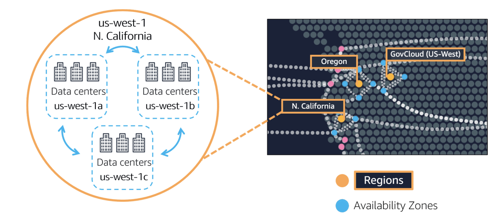
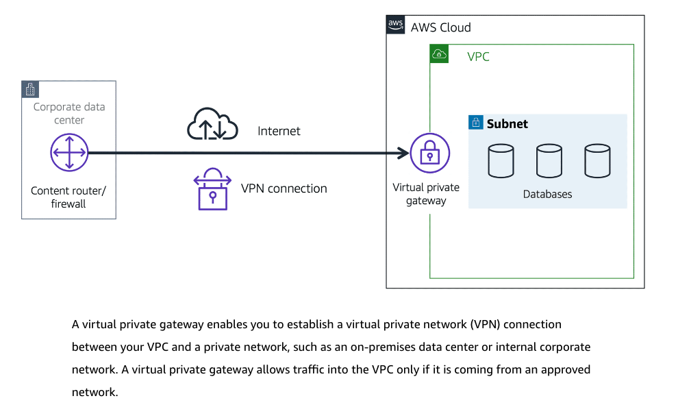
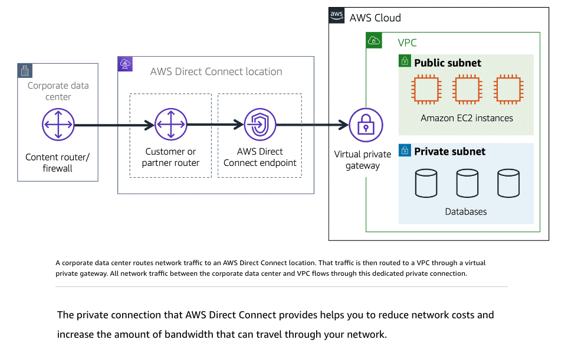
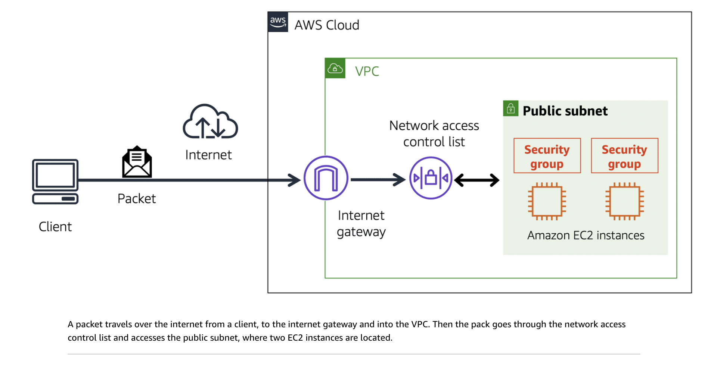
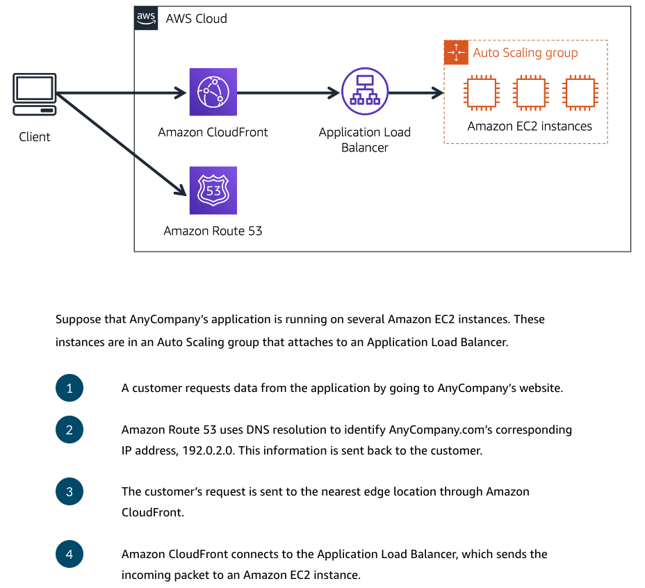

# AWS certification notes-Solution Architect AssociateC03

## EC2 - Elastic Cloud Computing
- Select based **compute, memory, storage** requirements
- Types of instances:

|Type | Features | Potential Use Cases|
|-----|----------|---------------------|
| General purpose instances | equal compute, memory, storage (normal 1 CPU : 4 GiB memory)| general applications (e.g. web servers, code repositories) |
| Compute optimised instances | ideal for compute-bound applications that need high-performance processors. Good to use them for batch processing workloads that require processing many transactions in a single group (normal 1 CPU : ~2 GiB memory) | more compute extensive operations (e.g.  high-performance web servers, high performance computing (HPC), compute-intensive applications servers, and dedicated gaming servers, scientific modeling)|
| Memory optimised instances | more memory optimised, good for applications that are larger and need more memory (e.g. 1 CPU : 8 or more GiB memory)| Workloads that requires large amounts of data to be pre-loaded before running, e.g .high performance database, large machine learning models, high-performance database |
| Accelerated computing instances | utilises hardware accelerators, or coprocessors, to perform some functions more efficiently than is possible in software running on CPUs (using GPUs too?) | floating-point number calculations, graphics processing, and data pattern matching (e.g. graphics applications, game streaming, and application streaming)|
| Storage optimised instances | handle high, sequential read and write access to large datasets on local storage | distributed file systems, data warehousing applications, high frequency online transaction processing (OLTP) systems |

- Types of pricing:
  
|Type | Scenario & Use Case | Flexibility | Pricing |
|-----|--------------------|---------|----|
|On-Demand | ideal for short-term, irregular workloads that cannot be interrupted. No upfront costs or minimum contracts apply. The instances run continuously until stopped, and pay for only the compute time used. Good for developing and testing applications and running applications that have unpredictable usage patterns | High | High |
| Standard Reserved Instances | Known and fixed EC2 instance type, size needed and in which AWS Region | Low (lock in for 1 or 3 years) | Low |
| Convertible Reserved Instances | need to run  EC2 instances in different Availability Zones or different instance types | Medium (locked in but can have flexibility to change type and area) | Medium |
| Instance Savings Plans | make an *_hourly*_ spend commitment to an instance family and Region for a 1-year or 3-year term. Unlike Reserved Instances, there is no need to specify upfront what EC2 instance type and size. | Medium | Low (similar to Standard Reserved Instances, can be ~ 72% cheaper than On-Demand) |
| Spot Instances | ideal for workloads with flexible start and end times, or that can withstand interruptions. Spot Instances use unused Amazon EC2 computing capacity and offer cost savings up to 90% off of On-Demand prices. | High | Low |
| Dedicated Hosts | physical servers with Amazon EC2 instance capacity that is fully dedicated to your use. | Low | High (most expensive)|

- Types of scaling:
  - dynamic scaling: responds to changing demand
  - predictive scaling: schedules the right number of EC2 instances based on predicted demand
- Auto-scaling settings (note: pay for only the instances you use, when you use them):
  - Minimum capacity - number of EC2 instances that will always be the baseline when application is deployed
  - Maximum capacity - number of max EC2 instances that can go up to if needed
  - Desired capacity - defaults to min capacity, if indicated will try to scale up to desired when instance is available
 

## Elastic Load Balancer (ELB)
Single point of contact for all incoming web traffic to the Auto Scaling group. This means that as Amazon EC2 instances are added or removed in response to the amount of incoming traffic, these requests route to the load balancer first. Elastic Load Balancing distributes the workload across the multiple instances so that no single instance has to carry the bulk of it. 

## Amazon Simple Queue Service (SQS) or Simple Notification Service (SNS) - Message and Queue
- To reduce dependencies. monolithic application (components are highly interdependent) vs microservices (more loosely coupled and robust)
- SQS: send, store, received messages/payloads between software components at any volume. messages are placed until processed
- SNS: can send notification between services and also to end-users. through publish/subscribe model 

## Serverless (more hands-free approach than EC2 - no need to provision or manage servers)
- AWS Lambda (good for short, quick processing): Just deploy code and it will run when there is a trigger. Runs within 15min before timeout (not suitable for long scripts). Good for service-oriented or event driven applications. No need to manage/provision servers
- AWS Elastic Container Service (ECS): docker based
- Amazon Elastic Kubernetes Service (EKS): run kubernetes
- AWS Fargate: Container orchestration platform, serverless compute engine for containers. It works with both Amazon ECS and Amazon EKS

## AWS Infrastructure:
### Region
- Geographically isolated areas
- Each region can have 1 or more Availability Zones (3 or more?)

Factors to look at:
1. Compliance: location-specific data regulations
2. Proximity / Latency: where are your customers mainly at
3. Feature availability: not all features you need are available in the region you want
4. Pricing: some locations are more expensive to operate in (e.g. Brazil's tax structure makes it more expensive to operate, even though the features are the same)

### Availability Zones (AZ)
- A single data centre or a group of them is an AZ. 1 region can have multiple AZ
- Best practice: run 2 or more AZ in the same region

## Content Delivery Network (CDN) - AWS' CDN is called Amazon CloudFront, & Domain Name Service (DNS) - AWS's called Route 53
- Delivers data (or video, audio etc) with low latency and high transfer speeds
- CloudFront has "Edge Locations" (different from regions), that you can use to distribute data

## AWS Outpost 
- Fully operational mini Region inside client's own data centre that's owned and operated by AWS and 100% AWS functionality but isolate in clients' own environment

## AWS Provisioning and Management
- AWS Management Console (Manual but good interface to point and click)
- AWS CLI
- AWS SDK
- AWS Elastic Beanstalk: provide code and configuration settings, deploys resources necessary to perform capacity adjustment, load balancing, automatic scaling, application health monitoring
- AWS CloudFormation:  treat your infrastructure as code, can build an environment by writing lines of code. Provisions  resources in a safe, repeatable manner, enabling you to frequently build your infrastructure and applications without having to perform manual actions. It determines the right operations to perform when managing your stack and rolls back changes automatically if it detects errors.

## Amazon Virtual Private Cloud (VPC) aka VPN
- VPC provisions an isolated section of the AWS cloud. Within a virtual private cloud (VPC), resources can be organised into subnets. A subnet is a section of a VPC that can contain resources such as Amazon EC2 instances.
- In a VPC, subnets are separate areas that are used to group together resources.

- Can configure subnets of the VPCs to be private (only allow traffic in from an internal network, need VPC) or public facing (can access from the public). 
- However just setting it to be private might not be totally safe because though they are private and they are encrypted, they still use a regular internet connection that has bandwidth that is being shared by many people using the internet. **AWS Direct Connect** is another service that allows user to establish a completely private, dedicated fiber connection from the data centre to AWS. 
  - AWS Direct Connect works with local partners in the user's region
  - AWS Direct Connect provides a physical line that connects your network to your AWS VPC, can help with high regulatory and compliance needs and sidestep any potential bandwidth issues.
- One VPC might have multiple types of gateways attached for multiple types of resources all residing in the same VPC, just in different subnets. 

- A subnet is a section of a VPC in which you can group resources based on security or operational needs. Subnets can be public or private.
  - Public subnets contain resources that need to be accessible by the public, such as an online store’s website.
  - Private subnets contain resources that should be accessible only through your private network, such as a database that contains customers’ personal information and order histories. 
  - In a VPC, subnets can communicate with each other. e.g. an application that involves Amazon EC2 instances in a public subnet can communicate with databases that are located in a private subnet.

## Security
- Network access control list (ACL): virtual firewall that controls inbound and outbound traffic at the **subnet** level
  - stateless packet filtering, ACL remembers nothing (doesn't remember whether the packet enter/exit previously) and check packets that cross the subnet border each way: inbound and outbound. (think custom officer)
  - Default allows all inbound and outbound traffic, unless you set custom rules. Custom rules default deny all until you specify which traffic to allow.
  - All network ACL has an explicit deny rule (aka blacklist function) - if the packet does not met any of the rules on the list, it will be denied

- Security Groups: Virtual firewall that controls inbound and outbound traffic at **EC2 instance** level
  - Default denies all inbound traffic and allows all outbound traffic
  - Can add rules to define which traffic to allow and it will deny all the rest (aka whitelist function)
  - Stateful packet filtering, remembers the packet that exits and will allow it back in, regardless of inbound security group rules.

## AWS' Global Networking (CDN and DNS services)
- **AWS Route 53**: AWS's DNS
- **AWS Cloudfront**: AWS' CDN
  - Content Delivery Network (CDN): A network that delivers edge content to users based on their Geographical location. Improves latency
  - Edge locations is a site that the AWS CloudFront uses to store cached copies of the content for faster delivery to the customers (aka a node)

## Data Storage
- EC2 has hard drives (called instance store) but they are ephemeral and will disappear after the EC2 instance is terminated. Cause it might not always be the same EC2 host that will service your application.
- **AWS Elastic Block Store (EBS)**: Separate storage drives that are persistent across different EC2. Can customise the size, type, configurations.
  - Has "snapshots" which are incremental backups. Incremental backup means that the first backup taken of a volume copies all the data. For subsequent backups, only the blocks of data that have changed since the most recent snapshot are saved. (think G-slides that only save the snapshot of the changes) 
  - Needs EC2 to write to EBS, and needs to be in the SAME AZ as the EC2
  - Stores delta changes of the file (so changes to the file doesn't need a full re-write of the whole file) 
  - Good if you need to constantly edit the files
  - Does not automatically scale up if you need more storage though
- **AWS Simple Storage Service(S3)**: store and retrieve virtually unlimited amount of data at any scale
  - file: object, buckets: folder. can create multiple buckets and store objects across different classes or tiers of data
  - max file size for an object: 5TB
  - can version objects to protect them from accidental deletion (will retain previous versions)
  - Good for write once read many (WORM), good for cases that a lot of people need to read the files
  - can tier based on frequency of retrieval of the data (e.g between frequent extraction and audit data)
  - each object consists of data, metadata, and a key. The data might be an image, video, text document, or any other type of file. Metadata contains information about what the data is, how it is used, the object size, and so on. An object’s key is its unique identifier.
  - S3's durability is 99.99999999999% (11 9s), aka the probability it will be available within a year
  - When selecting a storage class, consider 2 factors:
    - how often you plan to retrieve the data
    - how available you need the data to be
  - S3 can be used for static websites (static websites can include animations or videos, just that the content doesn't update that much)
  - S3 is web-enabled
  - Cheaper than EBS
  - Serveless storage (no EC2 is needed for storage to take place)
  - Any updates to the files/objects, the whole file/object will need to rewrite (whereas EBS only stores the delta updates)

|S3 Storage Class|Information|
|------|-------|
|S3 Standard| - Designed for frequently accessed data   - Stores data in minimum 3 Availability zones   Good choice for a wide range of use cases, such as websites, content distribution, and data analytics. Amazon S3 Standard has a higher cost than other storage classes intended for infrequently accessed data and archival storage. |
|S3 Standard-Infrequent Access (Standard-IA) | - Ideal for infrequently accessed data  - Similar to Amazon S3 Standard but has a lower storage price and higher retrieval price   Ideal for data infrequently accessed but requires high availability when needed. Both Amazon S3 Standard and Amazon S3 Standard-IA store data in a minimum of three Availability Zones. Amazon S3 Standard-IA provides the same level of availability as Amazon S3 Standard but with a lower storage price and a higher retrieval price. | 
| S3 One Zone-Infrequent Access (S3 One Zone-IA) | - Stores data in a single Availability Zone  - Has a lower price than S3 Standard-IA    Only stores data in a single Availability Zone (AZ). Good if you want to save costs on storage and you can easily reproduce your data in the event of an AZ failure. |
|S3 Intelligent-Tiering |- Ideal for data with unknown or changing access patterns  - Requires a small monthly monitoring and automation fee **per object**    Amazon S3 monitors objects’ access patterns. If you haven’t accessed an object for 30 consecutive days, Amazon S3 automatically moves it to the infrequent access tier, S3 Standard-IA. If you access an object in the infrequent access tier, Amazon S3 automatically moves it to the frequent access tier, S3 Standard.|
| S3 Glacier Instant Retrieval | - Works well for archived data that required immediate access  - Can retrieve objects within a few milliseconds (similar to standard) |
| S3 Glacier Flexible Retrieval | - Low cost storage designed for data archiving  - Able to retrieve objects within a few minutes to hours    example usage: store archived customer records or older photots and video files that you can wait for the retrieval |
| S3 Glacier Deep Archive | - Lowest cost object storage class ideal for archiving  - Able to retrieve objects within 12 hours  Good for long-term retention and digital preservation for data that might be accessed once or twice a year. Lowest cost storage in AWS, data retrieval from 12-48 hours. All objects in this storage class are replicated and stored across at least 3 geographically dispersed Availability Zones. |
| S3 Outposts | - Creates S3 buckets on Amazon S3 outposts  - Makes it easier to retrieve, store, and access data on AWS Outposts    AWS S3 Outposts (on premise on the client side) delivers object storage to on-premises AWS outposts environment. Stores data durably and redundantly across multiple devices and servers on your Outposts. It works well for workloads with local data residency requirements that must satisfy demanding performance needs by keeping data close to on-premises applications. |

- **AWS Elastic File System**: Auto-scaling according to the size that is needed, and allows multiple instances (aka multiple EC2, whereas EBS is 1:1) to access the data in EFS at the same time. 
  - Auto-scales when you need more storage -  As you add and remove files, Amazon EFS grows and shrinks automatically. It can scale on demand to petabytes without disrupting applications. 
  - Regional resource, stores data in and across multiple Availability Zones. Any EC2 in the region can access the EFS
  - The duplicate storage enables you to access data concurrently from all the Availability Zones in the Region where a file system is located. Additionally, on-premises servers can access Amazon EFS using AWS Direct Connect.
  - Compared to block storage (EBS) and object storage (S3), file storage is ideal for use cases in which a large number of services and resources need to access the same data at the same time.

  ## AWS Relational Database Service (RDS)
  - A managed service that automates tasks such as hardware provisioning, database setup, patching, backups, redundancy, failover, disaster recovery
  - Different security options:
    - encryption at rest (protecting data while it is stored)
    - encryption in transit (protecting data while it is being sent and received)
  - Different kinds of database engines which optimise for memory, performance, or input/output (I/O). Supported engines:
    1. Amazon Aurora:
      - Compatible with either MySQL and PostgreSQL
      - 5x faster than standard MySQL, 3x faster than standard PostgreSQL
      - 1/10th of cost of commercial databases
      - data replication, up to 15 read replicas
      - continuous backup to S3
      - point-in-time recovery
    2. PostgreSQL
    3. MySQL
    4. MariaDB
    5. Oracle Database
    6. Microsoft SQL Server

## AWS DynamoDB (Nonrelational/NoSQL database)
- Key-value pairs, data is organised into items (keys) and items have attributes (values)
- Able to add or remove attributes from items in the table at any time. Not every item in the table has to have the same attributes
- No need an upfront rigid DB schema
- May not be suitable for all kinds of use case, (not suitable if you need a lot of complex joins) but use it right, it can deliver single-digit millisecond performance
- Serverless, no need to provision, patch or manage any servers
- Auto-scaling
- Has petabyte scaling potential and granular API access

## AWS Redshift (Data warehousing as a service)
- Able to collect data from many sources and understand relationships and trends across your data 

## AWS Database Migration Service (DMS)
- Helps to migrate databases onto AWS
- Has a source and target database
- Source database can remain fully operational during the migration, hence minimising downtime for applications that rely on that database
- Source and target database don't have to be of the same type
  - same type of source and target database (e.g. MySQL to MySQL) is called "homogenous databases"
  - different types of source and target database (e.g. MySQL to PostgresSQL) are called "heterogenous databases". Schema structure, data types and database code might differ, hence a 2 step process might be necessary. 1st to convert them in the AWS Schema Conversion Tool
